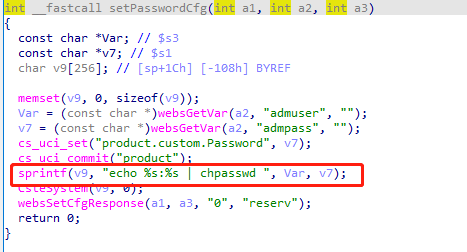
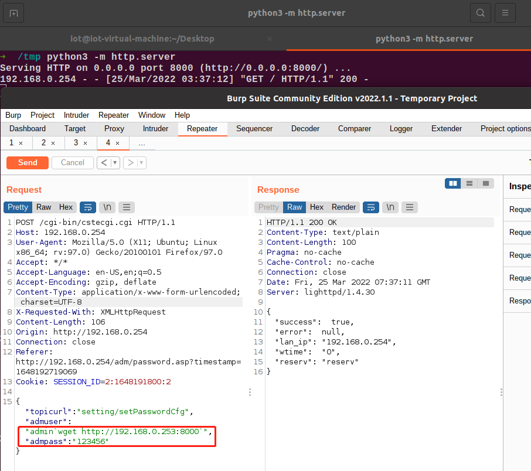

# TOTOLINK Vulnerability

Vendor:TOTOLINK

Product:CP900

Version:TOTOLINK_C8B810C-1A_CP900_CP0016_QCA9531_SPI_16M128M_V6.3c.566_B20171026_ALL.web

Link:http://www.totolink.cn/data/upload/20210720/5bee10397c082b0419cbad3eb7d1bd97.zip

Type:Remote Command Execution

## Vulnerabilty Description

Totolink outdoor CPE CP900  V6.3c.566_B20171026 were discovered to contain a command injection vulnerability in the setPasswordCfg function via the **adminuser** and **adminpass**parameter. This vulnerability allows attackers to execute arbitrary commands via a crafted request.

### Remote Command Execution

In cstecgi.cgi binary:

In setPasswordCfg function，**adminuser** and **adminpass** is directly passwd by the attacker,so we can control the **adminuser** and **adminpass** to attack the device.

As you can sess,in setPasswordCfg function,the input has not been checked.

Enventuall,the initial input will be extracted and cause command injection.

 

## POC

 

