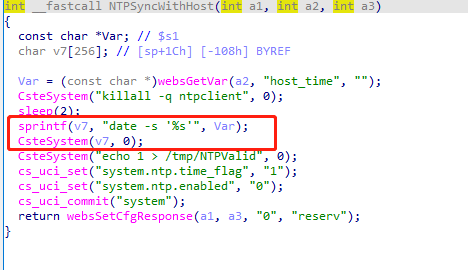
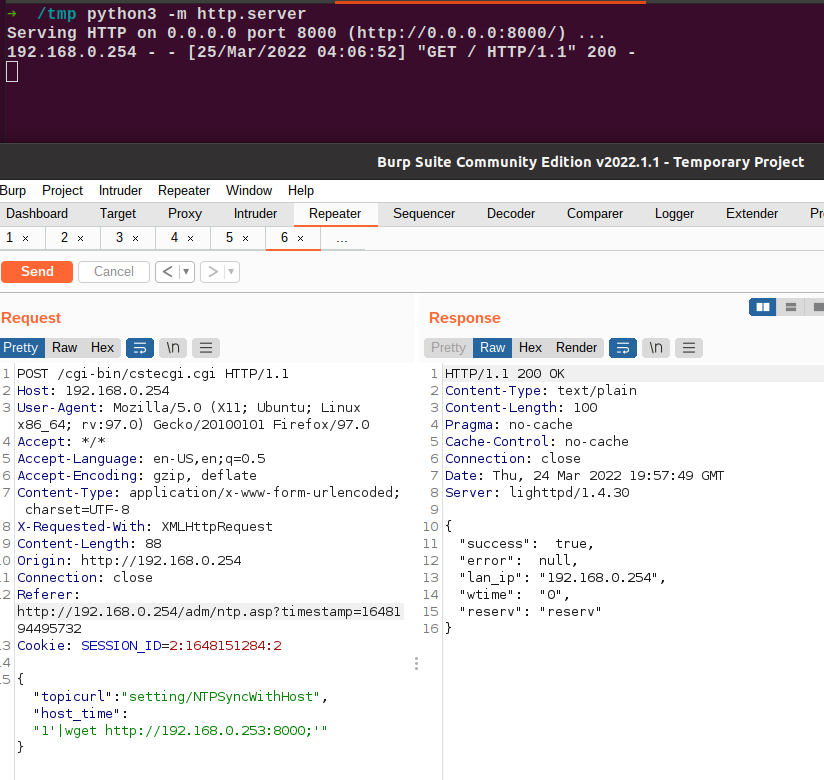
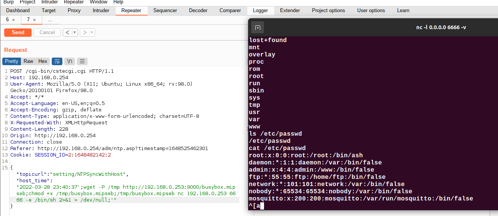

# TOTOLINK 命令注入漏洞

品牌: TOTOLINK

产品型号: CP900

固件版本: TOTOLINK_C8B810C-1A_CP900_CP0016_QCA9531_SPI_16M128M_V6.3c.566_B20171026_ALL.web

下载链接: http://www.totolink.cn/data/upload/20210720/5bee10397c082b0419cbad3eb7d1bd97.zip

## 漏洞细节

Totolink outdoor CPE CP900 V6.3c.566_B20171026版本。在NTPSyncWithHost函数中存在命令注入漏洞，未对host_time参数做过滤。该漏洞允许攻击者通过精心编制的请求执行任意命令。

 

## POC

 

