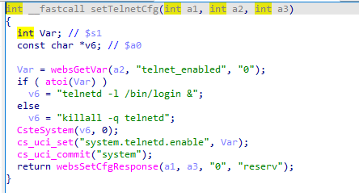
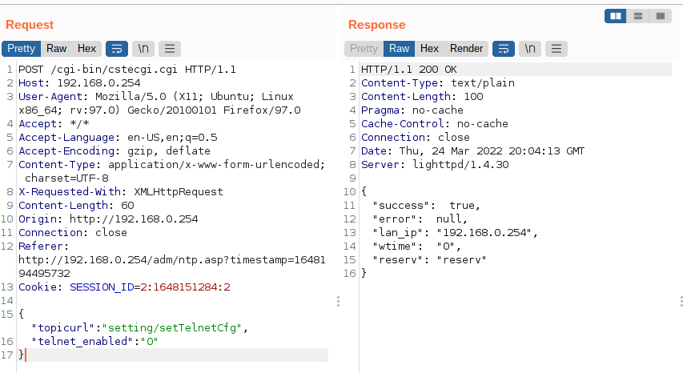

# TOTOLINK 存在后门服务漏洞

**Vendor**:TOTOLINK

**Product**:CP900

**Version**:TOTOLINK_C8B810C-1A_CP900_CP0016_QCA9531_SPI_16M128M_V6.3c.566_B20171026_ALL.web

**Link**:http://www.totolink.cn/data/upload/20210720/5bee10397c082b0419cbad3eb7d1bd97.zip

**Type**:BackDoor API

**Exploit Auth**:B2eFly@Hillstone

## 漏洞描述

允许攻击者远程开启telnet服务

In csecgi.cgi:

In setTelnetCfg function，**telnet_enabled** is directly passwd by the attacker,so we can control the **filename** to enable telnetd.

Enventuall,the initial input will be turn on telnetd.

  

## POC

